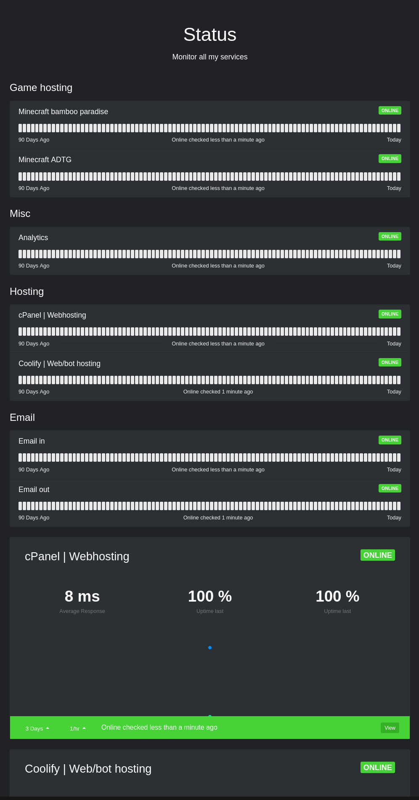

# StatPing-ng dark theme
A dark theme for [StatPing-ng](https://github.com/statping-ng/statping-ng).


## How to use this?
1. Run `sudo docker run -d -p 8080:8080 -v statping:/app adamboutcher/statping-ng`
2. Follow the installation process on http://localhost:8080 or your WAN IP/domain name.
3. Click on "Use local assets".
4. Run `cd /var/lib/docker/volumes/statping/_data/assets`.
5. Run `sudo rm *.scss`.
6. Run all next commands:
```
curl -s https://raw.githubusercontent.com/statping-ng/statping-ng/refs/heads/dev/frontend/src/assets/scss/index.scss -o index.scss
curl -s https://raw.githubusercontent.com/statping-ng/statping-ng/refs/heads/dev/frontend/src/assets/scss/base.scss -o base.scss
curl -s https://raw.githubusercontent.com/statping-ng/statping-ng/refs/heads/dev/frontend/src/assets/scss/variables.scss -o variables.scss
curl -s https://raw.githubusercontent.com/statping-ng/statping-ng/refs/heads/dev/frontend/src/assets/scss/layout.scss -o layout.scss
curl -s https://raw.githubusercontent.com/statping-ng/statping-ng/refs/heads/dev/frontend/src/assets/scss/forms.scss -o forms.scss
curl -s https://raw.githubusercontent.com/statping-ng/statping-ng/refs/heads/dev/frontend/src/assets/scss/mixin.scss -o mixin.scss
curl -s https://raw.githubusercontent.com/statping-ng/statping-ng/refs/heads/dev/frontend/src/assets/scss/mobile.scss -o mobile.scss
```
7. Go to http://localhost:8080/dashboard/settings and click on "Theme".
8. Replace "Variables" with `variables.scss` from this repo.
9. Replace "Base Theme" with `base.scss` from this repo.
10. Click on "Save Styles".